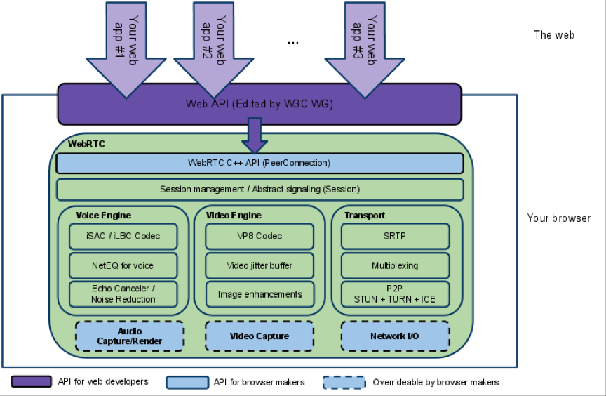
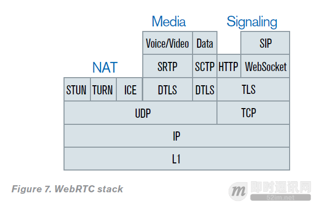

#WebRTC介绍
>WebRTC为Web应用开发者提供了在Web平台上编写丰富实时交互的多媒体应用的能力，不需要下载或者安装插件。目的是为了建立一个强大的跨浏览器、跨多个平台的实时交互平台。

##一、WebRTC简介
如图所示，WebRTC的特点是建立端到端的对等连接进行数据传输和提供信令服务器为两个客户端之间提供信令通道。对等连接主要用来传输媒体数据，信令通道主要用来传输控制信令如sdp、candidate等。

**图1-WebRTC交互图**

**图2-WebRTC交互图**

##二、[WebRTC架构](https://webrtc.org/architecture/)

**图3-WebRTC结构图**

从图3可以明显看到两层：

1.  浏览器开发者对于WebRTC C++ API比较感兴趣和采集、渲染方面比较感兴趣。
2.  Web 应用开发者对于Web API比较感兴趣。

WebRTC包含以下3大部分：

###传输和会话(Transport/Session)
传输/会话层：会话层组件采用了libjingle库的部分组件实现，无须使用xmpp/jingle协议。

####*RTP 网络协议栈（RTP Stack）*
> RTP 网络协议栈, 实时交互协议

####*STUN/ICE*
> P2P网络组件，帮助实时音视频通过STUN/ICE机制建立P2P网络连接，支出各种复杂的网络环境和类型

####*会话管理(Session Management)* 
> 一个抽象的会话层，提供会话建立和管理功能。该层协议留给应用开发者自定义实现。

###音频引擎(Voice Engine)

####*iSAC / iLBC / Opus*
>
#####(a) iSAC Internet Speech Audio Codec：针对VoIP和音频流的宽带和超宽带音频编解码器，是WebRTC音频引擎的默认的编解码器。
-  采样频率：16khz，24khz，32khz；（默认为16khz）
-  自适应速率为10kbit/s ~ 52kbit/；
-  自适应包大小：30~60ms；
-  算法延时：frame + 3ms
>
#####(b) iLBC Internet Low Bitrate Codec：VoIP音频流的窄带语音编解码器。标准由IETF RFC3951和RFC3952定义。
-  采样频率：8khz；
-  20ms帧比特率为15.2kbps
-  30ms帧比特率为13.33kbps
>
#####(c) Opus IETF 标准由 IETF RFC 6176定义。
-  采样频率：8kHZ(4kHz bandwith) ~ 48kHZ(20kHz bandwith)
-  比特率： 6kbit/s ~ 510kbit/s
-  帧大小:2.5ms ~ 60 ms
>
动态抖动缓冲器和错误处理算法用于处理数据包丢失和网络抖动带来的负面效果，在维持高质量音频的同时尽可能降低延迟。

####*回声消除器(Acoustic Echo Canceler)*
> 回声消除器是一个基于软件的信号处理元件，能实时的去除mic采集到的回声。

####*噪声抑制(Noise Reduction)* 
> 噪声抑制也是一个基于软件的信号处理元件，用于消除与相关VoIP的某些类型的背景噪声（嘶嘶声，风扇噪音等等… …）

###视频引擎(Video Engine)

####*VP8*
> 来自于WebM 项目的Video codec, 非常适用于RTC低延迟的场景。

####*视频抖动缓冲器(Video Jitter Buffer)*
> 视频动态抖动缓存器，帮助减少因为抖动和数据包丢失对视频质量的影响。

####*图像质量增强模块(Image enhancements)* 
> 例如移除从Web摄像头采集到的图像的图像噪点。
##三、WebRTC协议栈
###3.1 WebRTC协议栈概览
**图4-WebRTC协议栈**
 
从图4中可以看出：

1. 不像其他浏览器或者APP通讯那样使用TCP协议来传输数据，WebRTC通过UDP协议传输媒体数据，通过TCP协议来传输信令。信令主要是用于建立、维护及断开连接等。之所以WebRTC使用UDP来传输媒体数据主要是因为WebRTC用于实时音视频方面，实时音视频对于传输时延的要求远高于对于可靠性的要求，即使丢失掉部分帧，画面也是连续的，对用户的体验影响并不大。这也是由于TCP和UDP的特点决定的，TCP 提供可靠传输并且保证传输的顺序，是一个面向连接的传输控制协议。如果某个数据包丢失，TCP缓存所有它之后的数据包，等待重传后，将数据包顺序返回给上层应用；UDP 并不保证传输的可靠性和传输的顺序，当它接收到某个数据包时候就立即返回给上层应用。实际上，UDP仅对IP层做了简单包装，数据量小于TCP。UDP是WebRTC通信的基础，为了满足WebRTC的所有需求，浏览器需要一系列支持穿透多层NAT设备和防护墙的协议和服务,为每个流协商参数，提供用户数据加密，实现拥塞和流量控制等。

2. WebRTC相关的协议分为NAT相关、RTP相关、信令相关3个协议栈。其中NAT相关的STUN、TURN、ICE都是基于UDP的。 RTP相关的DTLS是基于UDP的，SRTP和SCTP又基于DTLS。 信令相关的TLS是基于TCP的，其上面使用的SIP、WebSocket、XMPP等又是基于TLS协议的。

###3.2 名词解释
+ ICE: Interactive Connectivity Establishment，交互式连接建立
+ STUN: Session Traversal Utilities for Network Address Translation (NAT) NAT环境下的会话传输工具
+ TURN: Traversal Using Relays around NAT 使用中继穿透NAT
+ SDP: Session Description Protocol 会话描述协议
+ DTLS: Datagram Transport Layer Security 数据报安全传输协议 DTLS用于安全传输端对端之间的所有数据，使用加密了加密技术。
+ SCTP: Stream Control Transport Protocol 流控制传输协议
+ SRTP: Secure Real-Time Transport Protocol 安全实时传输协议 

###3.3 SDP 会话描述协议
SDP提供了协商媒体信息以及交换IP地址和端口号的能力。

会话描述协议（SDP）是一种描述性协议，用与通知和管理会话邀请的标准方法，以及执行其他多媒体会话的启动任务。 SDP表达浏览器的能力，使用文本格式，可能包括以下信息： 

- 媒体功能（视频，音频）和使用的编解码器 
- IP地址和端口号 
- P2P数据传输协议（WebRTC使用SecureRTP） 
- 通信可用带宽
- 会话属性（名称，标识符，活动时间等） 
- 其他相关元数据等。

SDP广泛应用于会话初始协议（SIP），实时传输协议（RTP）和实时流协议（RSP）的环境中。

### 3.4 ICE 交互式连接建立
信令初始被用来中间服务器交换元数据，但完成之后WebRTC尝试建立一个用户间的P2P直连连接。这个过程通过ICE框架进行。

ICE是一个用来建立互联网上P2P连接的框架。尽管WebRTC尝试直接建立P2P连接，但实际上由于NAT设备的的广泛使用，使得两个端之间的通信变得非常困难。

由于IPv4地址仅有32位，数量有限，远满足不了每个设备有一个公网IP的需求，因此大部分网络设备都没有互联网上的公网IP。NAT通过动态将一个出站请求的私有IP地址翻译成公网IP来进行工作。同样将一个入站请求的公网IP翻译成私有IP地址来保证互联网路由正常工作。因此，分享一个私有IP信息并不足以建立一个P2P连接。ICE 尝试解决NAT造成的通信不变，找到一个端对端的最佳连接路径。

通过平行尝试所有可能，ICE可以选择最有效的方式。 ICE是首先尝试是从设备的操作系统或者网卡获得的主机地址建立连接；如果失败， ICE通过STUN服务器获取公网IP地址建立连接。如果仍然失败，流量将使用TURN中继服务器来进行路由。

候选通信路由以文本方式呈现，并且按照优先级排序。优先级排序：

- 直接P2P通信（两台设备位于同一NAT设备之后）
- 使用STUN获得的NAT映射的IP和端口建立连接(两台设备位于不同的NAT设备之后，但不是对称NAT类型)
- 使用TURN服务器中继方式(对称NAT类型)

在所有可能的候选者中，选择开销最小的路由方式。
### 3.5 STUN
为了进行P2P通信，所有的参与方都需要知道其他对等方的IP地址及分配的UDP端口。因此，在建立WebRTC通信之前需要交换一些必要的信息。

STUN 服务器被用来每个端来获取他们的公网IP地址，并在建立连接期间被ICE框架引用。 STUN服务器通过是可以公开访问的，而且可以被WebRTC应用自由使用。
### 3.6 TURN
在建立P2P通信失败的情况下，可以使用TURN 服务器中继方式来作为备选。使用中继方式可以保证WebRTC之间的通信，但可能会引起媒体质量降级和时延更长的影响。
无论最终用户环境如何，TURN服务器都可以保证成功建立通话。由于数据发送通过中继服务器，服务器也会消耗带宽。如果许多通话都通过服务器路由，那么消耗的带宽也很大。
TURN服务器一般不能自由访问，需要由应用提供商提供（或租用）。
### 3.7 DTLS
WebRTC加密信息使用数据包安全传输协议DTLS, 所有通过RTCDataChanel发送的数据都通过DTLS传输。

DTLS是一个标准协议，所有支持WebRTC的浏览器都内置实现了它，而且被Web浏览器、Email、VOIP平台用来加密信息。由于其是内置的所以使用之前并不需要预先设置。和其他加密协议一样，DTLS旨在防止窃听和信息篡改。 DTLS和基于流的TLS协议一样，使用非对称加密算法提供完全加密、数据认证和消息认证。TLS是Web加密事实标准，用于HTTPS等协议。不同的是，TLS专为TCP的可靠传输机制而设计，但VOIP类应用（以及游戏等）通过使用像UDP这样不可靠的数据报传输。

DTLS由SSL衍生而来，传输数据时使用DTLS和任何使用SSL的连接一样安全。事实上，WebRTC数据可以通过任何基于标准SSL的连接来保护，从而使WebRTC提供端到端加密。
### 3.8 SRTP
基础的RTP没有任何内置的安全机制，因此不保护传输数据的机密性。外部机制取而代之提供加密。事实上WebRTC规范明确禁止使用未加密的RTP。

WebRTC使用SRTP加密媒体流而是使用DTLS，主要是因为SRTP是比DTLS更轻的选项。规范要求任何兼容WebRTC的实现都支持RTP/SAVPF(建立在RTP/SAVP之上)。但是，实际的SRTP密钥交换最初是通过端到端的DTLS-SRTP执行的，从而可以检测到任何MITM攻击。
### 3.9 SCTP
流控制传输协议是位于传输层的计算机网络传输协议，类似于TCP和UDP。
SCTP提供了UDP和TCP的一些特性：它像UDP一样是面向消息的，并且确保可靠的按照TCP的拥塞控制按顺序传输消息。它不同于这些协议，通过提供多归属和冗余路径来增加弹性和可靠性。
##四、WebRTC Demo 地址
Demo及体验地址，因为Demo连接的https://appr.tc，国内需要开启vpn才能访问。Android和IOSDemo都是通过WebSocket进行信令交互的。

+ [浏览器](https://appr.tc)
+ [Android Demo 源码](https://github.com/njovy/AppRTCDemo)
+ [iOS Demo 源码](https://github.com/ISBX/apprtc-ios)

##五、WebRTC 优缺点、应用场景及前景
WebRTC优点如下：

1. 方便。对于用户来说，在WebRTC出现之前想要进行实时通信就需要安装插件和客户端，但是对于很多用户来说，插件的下载、软件的安装和更新这些操作是复杂而且容易出现问题的，现在WebRTC技术内置于浏览器中，用户不需要使用任何插件或者软件就能通过浏览器来实现实时通信。对于开发者来说，在Google将WebRTC开源之前，浏览器之间实现通信的技术是掌握在大企业手中，这项技术的开发是一个很困难的任务，现在开发者使用简单的HTML标签和JavaScript API就能够实现Web音/视频通信的功能。
2.  免费。虽然WebRTC技术已经较为成熟，其集成了最佳的音/视频引擎，十分先进的codec，但是Google对于这些技术不收取任何费用。
3.  强大的打洞能力。WebRTC技术包含了使用STUN、ICE、TURN、RTP-over-TCP的关键NAT和防火墙穿透技术，并支持代理。

WebRTC缺点如下：

1. 缺乏服务器方案的设计和部署。
2. 传输质量难以保证。WebRTC的传输设计基于P2P，难以保障传输质量，优化手段也有限，只能做一些端到端的优化，难以应对复杂的互联网环境。比如对跨地区、跨运营商、低带宽、高丢包等场景下的传输质量基本是靠天吃饭，而这恰恰是国内互联网应用的典型场景。
2. WebRTC比较适合一对一的单聊，虽然功能上可以扩展实现群聊，但是没有针对群聊，特别是超大群聊进行任何优化。
3. 设备端适配，如回声、录音失败等问题层出不穷。这一点在安卓设备上尤为突出。由于安卓设备厂商众多，每个厂商都会在标准的安卓框架上进行定制化，导致很多可用性问题（访问麦克风失败）和质量问题（如回声、啸叫）。
4. 对Native开发支持不够。WebRTC顾名思义，主要面向Web应用，虽然也可以用于Native开发，但是由于涉及到的领域知识（音视频采集、处理、编解码、实时传输等）较多，整个框架设计比较复杂，API粒度也比较细，导致连工程项目的编译都不是一件容易的事。

WebRTC 应用场景

1.  社交通讯、语音通话、视频通话
2.  办公远程视频会议、视频招聘、安防监控
3.  智能硬件和智慧家居
4.  直播行业中游戏直播、美女秀场、电视直播
5.  传统行业结合，如在线教育、在线医疗、金融开户、呼叫中心、在线翻译、相亲交友
6.  p2p与文件传输：这个于音视频无关，不过很多人在用webrtc这套机制。
7.  虚拟现实：同上。

