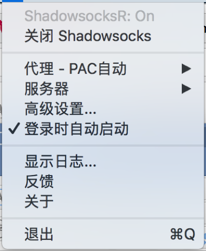
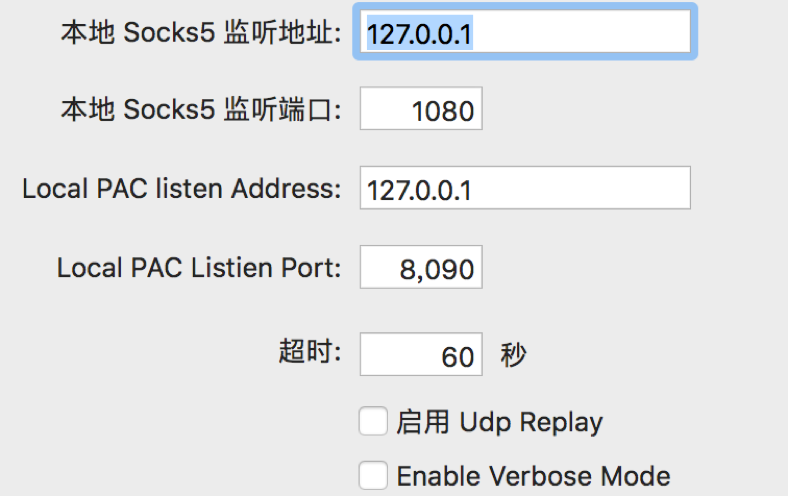
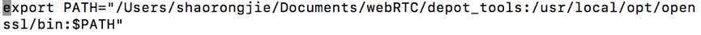

#WebRTC源码下载编译
>WebRTC为Web应用开发者提供了在Web平台上编写丰富实时交互的多媒体应用的能力，不需要下载或者安装插件。目的是为了建立一个强大的跨浏览器、跨多个平台的实时交互平台。

##一、WebRTC源码下载编译前的准备
WebRTC需要从google网站上下载，国内由于墙的原因不能直接下载，需要开启VPN才能下载。但现在很多VPN是使用socks5协议的（如[纸飞机](https://kingekinge.info/)）。由于Git 和很多脚本直接使用HTTP协议，本身并不支持socks5协议，会导致后续下载编译时候需要一些困难。因此需要配置Git的http代理和全局配置HTTP代理。

以Shadowsocks为例，可以查看socks5代理的端口，Mac上点击右上角的纸飞机图案，弹出如下面板

**图1- 设置面板Shadowsocks面板**


点击高级设置，可以看到本地Socks5监听地址和本地Socks5监听端口，和下面脚本中的IP地址和端口一致。

**图2- Shadowsocks高级设置**



+ Git 配置代理

Git开启HTTP代理

```JavaScript
git config --global http.proxy 'socks5://127.0.0.1:1080' 
git config --global https.proxy 'socks5://127.0.0.1:1080'
```
Git关闭HTTP代理

```JavaScript
git config --global --unset http.proxy
git config --global --unset https.proxy
```
Git查看代理状况

```JavaScript
git config --get http.proxy
git config --get https.proxy
```

+ HTTP 配置代理

对于 HTTP代理，可以在.bashrc或者.zshrc添加，通过vi .bashrc，然后添加下面代码

```JavaScript
export http_proxy="socks5://127.0.0.1:1080"
export https_proxy="socks5://127.0.0.1:1080"
export ALL_PROXY=socks5://127.0.0.1:1080
```
然后ESC后:wq保存文件，接着在终端中执行
source ~/.bashrc


##二、安装depot tools
depot tools是google 管理chromium的工具。下载webRTC源代码，需要先安装depot tools, 由于之前已经安装配置了vpn和git 代理，直接在创建的目录下执行

```JavaScript
git clone https://chromium.googlesource.com/chromium/tools/depot_tools.git
```
然后vi .bash_profile，将对应路径加入进去

**图3- bash_profile内容**



然后ESC后。:wq保存文件，接着在终端中执行 source ~./bash_profile就可以了。


##三、下载安装ninja
获得并编译ninja的代码

```JavaScript
git clone git://github.com/martine/ninja.git
cd ninja/
./bootstrap.py
```
上述步骤会在当前目录下产生一个ninja的可运行文件。使用以下命令把它复制到/usrlocal/bin下，修改权限为可执行

```JavaScript
sudo cp ninja /usr/local/bin/
sudo chmod a+rx /usr/local/bin/ninja
```
##四、下载编译webRTC

创建webRTC编译目录

```JavaScript
mkdir webrtc-build
cd webrtc-build
```
然后在webrtc-build目录，根据平台，执行对应的下载编译命令

+ Windows

```JavaScript
fetch --nohooks webrtc
gclient sync
gclient runhooks
```
+ Linux

```JavaScript
export GYP_DEFINES="OS=linux"
fetch --nohooks webrtc_android
gclient sync
gclient runhooks
```
+ Android

```JavaScript
export GYP_DEFINES="OS=android"
fetch --nohooks webrtc_android
gclient sync
gclient runhooks
```
+ Mac

```JavaScript
export GYP_DEFINES="OS=mac"
fetch --nohooks webrtc_ios
gclient sync
gclient runhooks
```
+ IOS

```JavaScript
export GYP_DEFINES="OS=ios"
fetch --nohooks webrtc_ios
gclient sync
gclient runhooks
cd src/tools_webrtc/ios
./build_ios_libs.sh
```

在执行gclient runhooks时候可能会遇到类似下面的的错误

```JavaScript
gn.py: Could not find gn executable at: /Users/shaorongjie/Documents/webRTC/depot_tools/mac/gn
```

这个是因为下载gn文件失败，需要下载gn文件。
可以通过gclient sync 下载，然而执行gclient sync 的时候，你会发现有这样的错误

```JavaScript
Failed to fetch file gs://chromium-gn/a68b194afb05d6a6357cf2e2464136ed7723c305 for src/buildtools/mac/gn. ... Error: Command 'download_from_google_storage --no_resume --platform=darwin --no_auth --bucket chromium-gn -s src/buildtools/mac/gn.sha1' returned non-zero exit status ...
```

翻墙代理的问题， gclient sync 里的某些子命令似乎在代理环境下无法正确连接谷歌服务器，准确说是连接上了，但是验证会卡非常长时间然后验证失败无法下载。一开始以为是代理没配置好，专门给命令行也配置了代理依然不行。
这里我是将

```JavaScript
gs://chromium-gn/a68b194afb05d6a6357cf2e2464136ed7723c305
```
替换成

```JavaScript
https://storage.googleapis.com/chromium-gn/a68b194afb05d6a6357cf2e2464136ed7723c305
```
然后放在浏览器里面下载,将下载的文件放在
/Users/shaorongjie/Documents/webRTC/depot_tools/mac/gn 目录下
然后

```JavaScript
cd  /Users/shaorongjie/Documents/webRTC/depot_tools/mac/
sudo chmod a+rx gn
```
然后重新执行gclient sync 和gclient runhooks，最后再执行对应平台编译脚本


