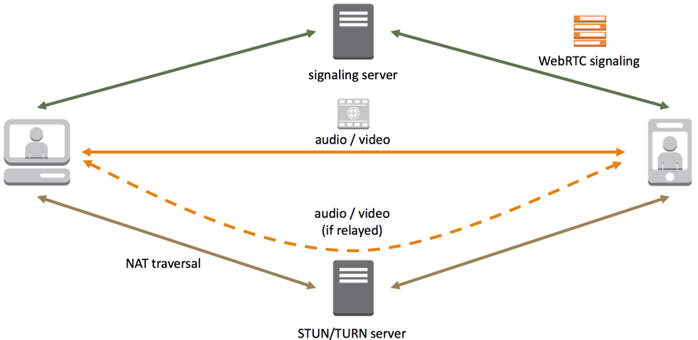
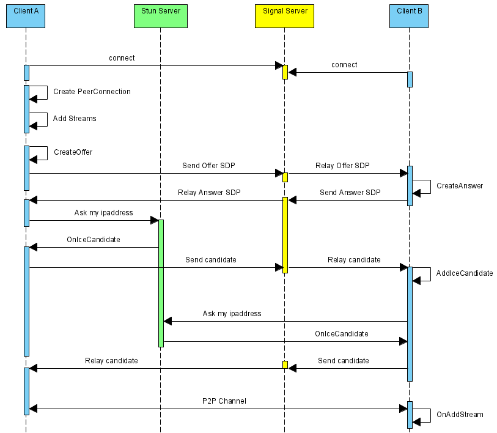

#WebRTC流程介绍
>在[WebRTC介绍](webrtc_1.md)中提到WebRTC两个客户端之间通过对等连接传输媒体数据、通过信令通道传输控制信令。本文主要讲述WebRTC之间的通讯和信令交互流程。本文交互细节部分参考自[WebRTC手记之初探](http://www.cnblogs.com/fangkm/p/4364553.html)

##一、WebRTC交互概览
**图1-WebRTC交互概览**

如图所示,Peer表示客户端，signaling server代表信令服务器， STUN/TURN Server表示STUN/TURN服务器，主要用于P2P打洞。如果两个客户端之间直接建立了P2P连接，则媒体数据(audio/video)直接通过P2P链接传输。如果不能直接建立P2P连接，媒体数据通过TURN服务中转，即图中虚线所示。

##二、WebRTC交互细节
[WebRTC交互细节](http://www.cnblogs.com/fangkm/p/4364553.html)如下图：

**图2-WebRTC通讯流程**

WebRTC中客户端与信令服务器、STUN/TURN服务器的交互流程如下：

1. ClientA首先创建PeerConnection对象，然后打开本地音视频设备，将音视频数据封装成MediaStream添加到PeerConnection中。

2. ClientA调用PeerConnection的CreateOffer方法创建一个用于offer的SDP对象，SDP对象中保存当前音视频的相关参数。ClientA通过PeerConnection的SetLocalDescription方法将该SDP对象保存起来，并通过Signal服务器发送给ClientB。

3. ClientB接收到ClientA发送过的offer SDP对象，通过PeerConnection的SetRemoteDescription方法将其保存起来，并调用PeerConnection的CreateAnswer方法创建一个应答的SDP对象，通过PeerConnection的SetLocalDescription的方法保存该应答SDP对象并将它通过Signal服务器发送给ClientA。

4. ClientA接收到ClientB发送过来的应答SDP对象，将其通过PeerConnection的SetRemoteDescription方法保存起来。

5. 在SDP信息的offer/answer流程中，ClientA和ClientB已经根据SDP信息创建好相应的音频Channel和视频Channel并开启Candidate数据的收集，Candidate数据可以简单地理解成Client端的IP地址信息（本地IP地址、公网IP地址、Relay服务端分配的地址）。

6. 当ClientA收集到Candidate信息后，PeerConnection会通过OnIceCandidate接口给ClientA发送通知，ClientA将收到的Candidate信息通过Signal服务器发送给ClientB，ClientB通过PeerConnection的AddIceCandidate方法保存起来。同样的操作ClientB对ClientA再来一次。

7. 这样ClientA和ClientB就已经建立了音视频传输的P2P通道，ClientB接收到ClientA传送过来的音视频流，会通过PeerConnection的OnAddStream回调接口返回一个标识ClientA端音视频流的MediaStream对象，在ClientB端渲染出来即可。同样操作也适应ClientB到ClientA的音视频流的传输。

上述序列中，WebRTC并不提供Stun服务器和Signal服务器，服务器端需要自己实现。Stun服务器可以用google提供的实现stun协议的测试服务器（stun:stun.l.google.com:19302），Signal服务器则完全需要自己实现了，它需要在ClientA和ClientB之间传送彼此的SDP信息和candidate信息，ClientA和ClientB通过这些信息建立P2P连接来传送音视频数据。
