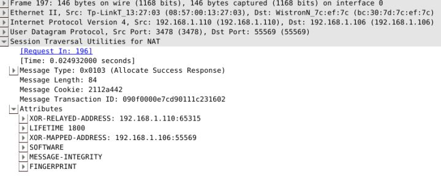
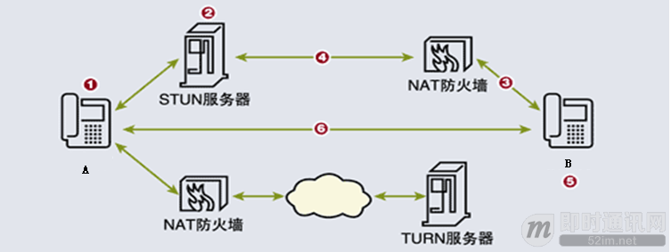

#P2P技术之STUN、TURN、ICE详解
>本文将讲述WebRTC中使用的P2P技术，重点讲解STUN、TURN技术以及ICE框架。本文内容整理自[P2P技术详解(三)：P2P技术之STUN、TURN、ICE详解](http://www.52im.net/thread-557-1-1.html)、[
通俗易懂：快速理解P2P技术中的NAT穿透原理](http://www.52im.net/thread-1055-1-1.html)等文章。

##一、内容概述

在现实Internet网络环境中，大多数计算机主机都位于防火墙或NAT之后，只有少部分主机能够直接接入Internet。很多时候，我们希望网络中的两台主机能够直接进行通信，即所谓的P2P通信，而不需要其他公共服务器的中转。由于主机可能位于防火墙或NAT之后，在进行P2P通信之前，我们需要进行检测以确认它们之间能否进行P2P通信以及如何通信。这种技术通常称为NAT穿透（NAT Traversal）。最常见的NAT穿透是基于UDP的技术，如RFC3489中定义的STUN协议。

STUN，首先在RFC3489中定义，作为一个完整的NAT穿透解决方案，英文全称是Simple Traversal of UDP Through NATs， 即穿越NAT的简单UDP传输，是一个轻量级的协议，允许应用程序发现自己和公网之间的中间件类型，同时也能允许应用程序发现自己被NAT分配的公网IP。这个协议在2003年3月被提出，其介绍页面里 说到已经被STUN/RFC5389所替代。

在新的RFC5389中，STUN的全称为Session Traversal Utilities for NAT，即NAT环境下的会话传输工具，是一种处理NAT传输的协议，但主要作为一个工具来服务于其他协议。和STUN/RFC3489 类似，可以被终端用来发现其公网IP和端口，同时可以检测端点间的连接性，也可以作为一种保活（keep-alive）协议来维持NAT的绑定。和RFC3489最大的不同点在于，STUN本身不再是一个 完整的NAT传输解决方案，而是在NAT传输环境中作为一个辅助的解决方法，同时也增加了TCP的支持。RFC5389废弃了RFC3489，因此后者通常称为classic STUN，但依旧是后向兼容的。 而完整的NAT传输解决方案则使用STUN的工具性质，ICE就是一个基于offer/answer方法的完整NAT传输方案，如SIP。

TURN的全称为Traversal Using Relays around NAT，是STUN/RFC5389的一个拓展，主要添加了Relay功能。如果终端在NAT之后， 那么在特定的情景下，有可能使得终端无法和其对等端（peer）进行直接的通信，这时就需要公网的服务器作为一个中继， 对来往的数据进行转发。这个转发的协议就被定义为TURN。TURN和其他中继协议的不同之处在于，它允许客户端使用同一个中继地址（relay address） 与多个不同的peer进行通信。

使用TURN协议的客户端必须能够通过中继地址和对等端进行通讯，并且能够得知每个peer的的IP地址和端口（确切地说，应该是peer的服务器反射地址）。 而这些行为如何完成，是不在TURN协议范围之内的。其中一个可用的方式是客户端通过email来告知对等端信息， 另一种方式是客户端使用一些指定的协议，如“introduction” 或 “rendezvous”，详见RFC5128

ICE的全称Interactive Connectivity Establishment（互动式连接建立），由IETF的MMUSIC工作组开发出来的，它所提供的是一种框架，使各种NAT穿透技术可以实现统一。ICE跟STUN和TURN不一样，ICE不是一种协议，而是一个框架（Framework），它整合了STUN和TURN。
##二、STUN详解
###2.1 STUN用途
**目前定义了三种STUN用途:**
>
+ Interactive Connectivity Establishment（ICE）[MMUSIC-ICE]，交互式连接建立
+ Client-initiated connections for SIP [SIP-OUTBOUND]，用于SIP的客户端初始化连接
+ NAT Behavior Discovery [BEHAVE-NAT]，NAT行为发现

###2.2 STUN通信流程
STUN协议为终端提供一种方式能够获知自己经过NAT映射后的公网地址，查出自己位于哪种类型的NAT之后以及NAT为某一个本地端口所绑定的Internet端端口，从而替代位于应用层中的私网地址，达到NAT穿透的目的。STUN协议是典型的Client-Server协议，各种具体应用通过嵌入STUN客户端与STUN Server端通讯来完成交互。

**图1-STUN工作示意图**


如图1，在典型的运用STUN进行NAT穿透的场景中，STUN客户端首先向位于公网上的STUN服务器 发送Binding Request消息，STUN服务器接收到请求消息后识别出经过NAT转换后的公网地址60.1.1.1:12345，将其附加在Binding Response消息中返回给客户端。客户端得到这个地址 后用它替换SDP中的私网地址与终端B完成媒体协商。使用STUN进行NAT穿透对应用的要 求是必须使用同样的端口与STUN服务器交互和进行应用层通讯，比如当希望使用端口 37000进行RTP包的NAT穿透时，必须同样使用37000端口与STUN服务器通讯，否则从STUN 服务器获得的NAT映射后的地址一般与实际地址时不一样的。另一个要求是STUN客户端与 服务器端的通讯和应用使用获得的NAT映射地址进行应用层通讯在时间上必须有连贯性， 这源于NAT设备建立的绑定有生存时间，当原绑定消亡后，NAT设备为同一个私网地址建 立的新绑定往往不同，因此转换后的公网地址是不同的。

###2.3 STUN如何判断NAT端口类型
STUN由STUN客户端、STUN服务器端、NAT路由器三部分组成。STUN服务端部署在一台有着两个公网IP的服务器上，大概的结构参考图2。STUN客户端通过向服务器端发送不同的消息类型，根据服务器端不同的响应来做出相应的判断，一旦客户端得知了Internet端的UDP端口，通信就可以开始了。

**图2-STUN结构图**


####2.3.1 STUN的检测过程
**STUN协议定义了三类测试过程来检测NAT类型：**
>
+ Test1：STUN Client通过端口{IP-C1:Port-C1}向STUN Server{IP-S1:Port-S1}发送一个Binding Request（没有设置任何属性）。STUN Server收到该请求后，通过端口{IP-S1:Port-S1}把它所看到的STUN Client的IP和端口{IP-M1,Port-M1}作为Binding Response的内容回送给STUN Client。
+ Test1#2：STUN Client通过端口{IP-C1:Port-C1}向STUN Server{IP-S2:Port-S2}发送一个Binding Request（没有设置任何属性）。STUN Server收到该请求后，通过端口{IP-S2:Port-S2}把它所看到的STUN Client的IP和端口{IP-M1#2,Port-M1#2}作为Binding Response的内容回送给STUN Client。
+ Test2：STUN Client通过端口{IP-C1:Port-C1}向STUN Server{IP-S1:Port-S1}发送一个Binding Request（设置了Change IP和Change Port属性）。STUN Server收到该请求后，通过端口{IP-S2:Port-S2}把它所看到的STUN Client的IP和端口{IP-M2,Port-M2}作为Binding Response的内容回送给STUN Client。
+ Test3：STUN Client通过端口{IP-C1:Port-C1}向STUN Server{IP-S1:Port-S1}发送一个Binding Request（设置了Change Port属性）。STUN Server收到该请求后，通过端口{IP-S1:Port-S2}把它所看到的STUN Client的IP和端口{IP-M3,Port-M3}作为Binding Response的内容回送给STUN Client。

**STUN协议的输出是:**
>
+ 1）公网IP和Port；
+ 2）防火墙是否设置；
+ 3）客户端是否在NAT之后，及所处的NAT的类型。

**因此我们进而整理出，通过STUN协议，我们可以检测的类型一共有以下七种：**
>
+ A：公开的互联网IP：主机拥有公网IP，并且没有防火墙，可自由与外部通信；
+ B：完全锥形NAT；
+ C：受限制锥形NAT；
+ D：端口受限制形NAT；
+ E：对称型UDP防火墙：主机出口处没有NAT设备,但有防火墙,且防火墙规则如下：从主机UDP端口A发出的数据包保持源地址，但只有从之前该主机发出包的目的IP/PORT发出到该主机端口A的包才能通过防火墙；
+ F：对称型NAT；
+ G：防火墙限制UDP通信。
####2.3.2 STUN协议的判断过程
输入和输出准备好后，附上一张维基百科的流程图图3，就可以描述STUN协议的判断过程了。
**图3-STUN判断流程图**


<font color="Sienna">STEP1：</font>检测客户端是否有能力进行UDP通信以及客户端是否位于NAT后 -- Test1
客户端建立UDP socket，然后用这个socket向服务器的（IP-1，Port-1）发送数据包要求服务器返回客户端的IP和Port，客户端发送请求后立即开始接受数据包。重复几次。
>
+ a）如果每次都超时收不到服务器的响应，则说明客户端无法进行UDP通信，可能是：G防火墙阻止UDP通信；
+ b）如果能收到回应，则把服务器返回的客户端的（IP:PORT）同（Local IP: Local Port）比较：
  - 如果完全相同则客户端不在NAT后，这样的客户端是：A具有公网IP可以直接监听UDP端口接收数据进行通信或者E。
  - 否则客户端在NAT后要做进一步的NAT类型检测（继续）。

<font color="Sienna">STEP2：</font>检测客户端防火墙类型 -- Test2
STUN客户端向STUN服务器发送请求，要求服务器从其他IP和PORT向客户端回复包：
>
+ a）收不到服务器从其他IP地址的回复，认为包前被前置防火墙阻断，网络类型为E；
+ b）收到则认为客户端处在一个开放的网络上，网络类型为A。

<font color="Sienna">STEP3：</font>检测客户端NAT是否是FULL CONE NAT -- Test2
客户端建立UDP socket然后用这个socket向服务器的(IP-1,Port-1)发送数据包要求服务器用另一对(IP-2,Port-2)响应客户端的请求往回发一个数据包，客户端发送请求后立即开始接受数据包。 重复这个过程若干次。
>
+ a）如果每次都超时，无法接受到服务器的回应，则说明客户端的NAT不是一个Full Cone NAT，具体类型有待下一步检测（继续）；
+ b）如果能够接受到服务器从(IP-2,Port-2)返回的应答UDP包，则说明客户端是一个Full Cone NAT，这样的客户端能够进行UDP-P2P通信。

<font color="Sienna">STEP4：</font>检测客户端NAT是否是SYMMETRIC NAT -- Test1#2
>
+ 客户端建立UDP socket然后用这个socket向服务器的(IP-1,Port-1)发送数据包要求服务器返回客户端的IP和Port, 客户端发送请求后立即开始接受数据包。 重复这个过程直到收到回应（一定能够收到，因为第一步保证了这个客户端可以进行UDP通信）。
+ 用同样的方法用一个socket向服务器的(IP-2,Port-2)发送数据包要求服务器返回客户端的IP和Port。
+ 比较上面两个过程从服务器返回的客户端(IP,Port),如果两个过程返回的(IP,Port)有一对不同则说明客户端为Symmetric NAT，这样的客户端无法进行UDP-P2P通信（检测停止）因为对称型NAT，每次连接端口都不一样，所以无法知道对称NAT的客户端，下一次会用什么端口。否则是Restricted Cone NAT，是否为Port Restricted Cone NAT有待检测（继续）。

<font color="Sienna">STEP5：</font>检测客户端NAT是Restricted Cone 还是 Port Restricted Cone -- Test3
客户端建立UDP socket然后用这个socket向服务器的(IP-1,Port-1)发送数据包要求服务器用IP-1和一个不同于Port-1的端口发送一个UDP 数据包响应客户端, 客户端发送请求后立即开始接受数据包。重复这个过程若干次。如果每次都超时，无法接受到服务器的回应，则说明客户端是一个Port Restricted Cone NAT，如果能够收到服务器的响应则说明客户端是一个Restricted Cone NAT。以上两种NAT都可以进行UDP-P2P通信。

通过以上过程，至此，就可以分析和判断出客户端是否处于NAT之后，以及NAT的类型及其公网IP，以及判断客户端是否具备P2P通信的能力了。

###2.4 STUN协议报文
STUN报文和大多数网络类型的格式一样，是以大端编码(big-endian)的，即最高有效位在左边。所有的STUN报文都以20字节的头部开始，后面跟着若干个属性。
####2.4.1 STUN报文头部
STUN消息头为20字节，后面紧跟0或多个属性。STUN头部包含一STUN消息类型、magic cookie、事务ID和消息长度。

**图4-STUN报文头部**


每个STUN消息的最高位前2位必须为0。当STUN协议为多个协议多路复用时若使用的是同一个端口，这可以用于与其他协议区分STUN数据包。消息类型确定消息的类别（如请求、成功回应、失败回应、标志）。虽然这里有四种消息类型，但可以分为2类事务：请求/响应事务、标志事务。

**图5-消息类型字段划分结构：**


**消息类型定义如下：**
>
+ 0b00，表示请求
+ 0b01，表示标志
+ 0b10，表示成功响应
+ 0b11，表示错误响应

魔术字域必须包含固定的值0x2112A442。在RFC3489中，该域是事务ID的一部分。配置魔术字允许服务器检测客户是否理解某些在改进的版本中增加的属性。另外，还可用于STUN多路复用时与其他协议的包进行区分。

96位的事务ID用于唯一的识别STUN事务。对于请求/响应事务，事务ID由STUN客户端来选择；对于标志事务，由代理（代理指支持STUN的客户端或服务器）来选择并发送。它主要服务于与请求相关的响应，因此它也扮演着一个帮助阻止确定类型的攻击的角色。服务器使用事务ID来唯一的标识出所有客户端的每一个事务。事务ID本身必须是唯一的，并且随机的从0到2的96-1次方中选择。重新发送相同的请求时，也必须使用新的事务ID。成功或错误响应必须携带与相对应的请求相同的事务ID。

消息长度字段不包括20字节的STUN头部。所有的STUN属性必须填充为4字节的倍数。消息长度字段的最后2位总是为0，这为区分STUN包与其他协议的包提供了另外一种方法。

####2.4.1 STUN消息属性
STUN头之后是0或多个属性。每个属性都采用TLV编码（Type-Length-Value）。其中Type字段和Length字段都是16位，Value字段为为32位表示，如下：

**图5-STUN消息属性结构：**


Length字段必须包含Value部分需要补齐的长度，以字节为单位。由于STUN属性以32bit边界对齐，因此属性内容不足4字节的都会以padding bit进行补齐。padding bit会被忽略，但可以是任何值。

Type字段为属性的类型。任何属性类型都有可能在一个STUN报文中出现超过一次。除非特殊指定，否则其出现的顺序是有意义的：即只有第一次出现的属性会被接收端解析，而其余的将被忽略。 为了以后版本的拓展和改进，属性区域被分为两个部分。Type值在0x0000-0x7FFF之间的属性被指定为强制理解，意思是STUN终端必须要理解此属性，否则将返回错误信息；而0x8000-0xFFFF 之间的属性为选择性理解，即如果STUN终端不识别此属性则将其忽略。目前STUN的属性类型由IANA维护。

**属性类型定义如下：**

+ <font color="Sienna">MAPPED-ADDRESS：</font>MAPPED-ADDRESS属性表示映射过的IP地址和端口。它包括8位的地址族，16位的端口号及长度固定的IP地址。
RESPONSE-ADDRESS：RESPONSE-ADDRESS属性表示响应的目的地址
+ <font color="Sienna">CHASNGE-REQUEST：</font>客户使用32位的CHANGE-REQUEST属性来请求服务器使用不同的地址或端口号来发送响应。
+ <font color="Sienna">SOURCE-ADDRESS：</font>SOURCE-ADDRESS属性出现在捆绑响应中，它表示服务器发送响应的源IP地址和端口。
+ <font color="Sienna">CHANGED-ADDRESS：</font>如果捆绑请求的CHANGE-REQUEST属性中的“改变IP”和“改变端口”标志设置了，则CHANGED-ADDRESS属性表示响应发出的IP地址和端口号。
+ <font color="Sienna">USERNAME：</font>USERNAME属性用于消息的完整性检查，用于消息完整性检查中标识共享私密。USERNAME通常出现在共享私密响应中，与PASSWORD一起。当使用消息完整性检查时，可有选择地出现在捆绑请求中。
+ <font color="Sienna">PASSWORD：</font>PASSWORD属性用在共享私密响应中，与USERNAME一起。PASSWORD的值是变长的，用作共享私密，它的长度必须是4字节的倍数，以保证属性与边界对齐。
+ <font color="Sienna">MESSAGE-INTEGRITY：</font>MESSAGE-INTEGRITY属性包含STUN消息的HMAC-SHA1，它可以出现在捆绑请求或捆绑响应中；MESSAGE-INTEGRITY属性必须是任何STUN消息的最后一个属性。它的内容决定了HMAC输入的Key值。
+ <font color="Sienna">ERROR-CODE：</font>ERROR-CODE属性出现在捆绑错误响应或共享私密错误响应中。它的响应号数值范围从100到699。
+ <font color="Sienna">UNKNOWN-ATTRIBUTES：</font>UNKNOWN-ATTRIBUTES属性只存在于其ERROR-CODE属性中的响应号为420的捆绑错误响应或共享私密错误响应中。
+ <font color="Sienna">REFLECTED-FROM：</font>REFLECTED-FROM属性只存在于其对应的捆绑请求包含RESPONSE-ADDRESS属性的捆绑响应中。属性包含请求发出的源IP地址，它的目的是提供跟踪能力，这样STUN就不能被用作DOS攻击的反射器。


这里重点介绍几个常见属性的Value结构：

+ <font color="Sienna">MAPPED-ADDRESS</font>

MAPPED-ADDRESS同时也是classic STUN的一个属性，之所以还存在也是为了前向兼容。其包含了NAT客户端的反射地址，Family为IP类型，即IPV4(0x01)或IPV6(0x02)， Port为端口，Address为32位或128位的IP地址。注意高8位必须全部置零，而且接收端必须要将其忽略掉。

```
 0                   1                   2                   3
 0 1 2 3 4 5 6 7 8 9 0 1 2 3 4 5 6 7 8 9 0 1 2 3 4 5 6 7 8 9 0 1
+-+-+-+-+-+-+-+-+-+-+-+-+-+-+-+-+-+-+-+-+-+-+-+-+-+-+-+-+-+-+-+-+
|0 0 0 0 0 0 0 0|    Family     |           Port                |
+-+-+-+-+-+-+-+-+-+-+-+-+-+-+-+-+-+-+-+-+-+-+-+-+-+-+-+-+-+-+-+-+
|                                                               |
|                 Address (32 bits or 128 bits)                 |
|                                                               |
+-+-+-+-+-+-+-+-+-+-+-+-+-+-+-+-+-+-+-+-+-+-+-+-+-+-+-+-+-+-+-+-+
```

+ <font color="Sienna">XOR-MAPPED-ADDRESS</font>

XOR-MAPPED-ADDRESS和MAPPED-ADDRESS基本相同，不同点是反射地址部分经过了一次异或（XOR）处理。对于X-Port字段，是将NAT的映射端口以小端形式与magic cookie的高16位进行异或，再将结果转换成大端形式 而得到的，X-Address也是类似。之所以要经过这么一次转换，是因为在实践中发现很多NAT会修改payload中自身公网IP的32位数据，从而导致NAT打洞失败。

```
  0 1 2 3 4 5 6 7 8 9 0 1 2 3 4 5 6 7 8 9 0 1 2 3 4 5 6 7 8 9 0 1
 +-+-+-+-+-+-+-+-+-+-+-+-+-+-+-+-+-+-+-+-+-+-+-+-+-+-+-+-+-+-+-+-+
 |x x x x x x x x|    Family     |         X-Port                |
 +-+-+-+-+-+-+-+-+-+-+-+-+-+-+-+-+-+-+-+-+-+-+-+-+-+-+-+-+-+-+-+-+
 |                X-Address (Variable)
 +-+-+-+-+-+-+-+-+-+-+-+-+-+-+-+-+-+-+-+-+-+-+-+-+-+-+-+-+-+-+-+-+
```

+ <font color="Sienna">ERROR-CODE</font>

ERROR-CODE属性用于error response报文中。其包含了300-699表示的错误代码，以及一个UTF-8格式的文字出错信息（Reason Phrase）。

```
 0                   1                   2                   3
   0 1 2 3 4 5 6 7 8 9 0 1 2 3 4 5 6 7 8 9 0 1 2 3 4 5 6 7 8 9 0 1
  +-+-+-+-+-+-+-+-+-+-+-+-+-+-+-+-+-+-+-+-+-+-+-+-+-+-+-+-+-+-+-+-+
  |           Reserved, should be 0         |Class|     Number    |
  +-+-+-+-+-+-+-+-+-+-+-+-+-+-+-+-+-+-+-+-+-+-+-+-+-+-+-+-+-+-+-+-+
  |      Reason Phrase (variable)                                ..
  +-+-+-+-+-+-+-+-+-+-+-+-+-+-+-+-+-+-+-+-+-+-+-+-+-+-+-+-+-+-+-+-+
```
另外，错误代码在语义上还与SIP和HTTP协议保持一致。比如：

+ <font color="Sienna">300（尝试代替 Try Alternate)：</font>客户端应该使用该请求联系一个代替的服务器。这个错误响应仅在请求包括一个USERNAME属性和一个有效的MESSAGE-INTEGRITY属性时发送；否则它不会被发送，而是发送错误代码为400的错误响应；
+ <font color="Sienna">400（错误请求Bad Request)：</font>请求变形了，客户端在修改先前的尝试前不应该重试该请求。
+ <font color="Sienna">401（未授权(Unauthorized)：</font>请求未包括正确的资格来继续。客户端应该采用一个合适的资格来重试该请求。
+ <font color="Sienna">420 （未知属性 Unknown Attribute)：</font>服务器收到一个STUN包包含一个强制理解的属性但是它不会理解。服务器必须将不认识的属性放在错误响应的UNKNOWN-ATTRIBUTE属性中。
+ <font color="Sienna">430（过期资格）：</font>捆绑请求没有包含MESSAGE-INTEGRITY属性，但它使用过期的共享私密。客户应该获得新的共享私密并再次重试。
+ <font color="Sienna">431（完整性检查失败）：</font>捆绑请求包含MESSAGE-INTEGRITY属性，但HMAC验
证失败。这可能是潜在攻击的表现，或者客户端实现错误
+ <font color="Sienna">432（丢失用户名）：</font>捆绑请求包含MESSAGE-INTEGRITY属性，但没有USERNAME属性。完整性检查中两项都必须存在。
+ <font color="Sienna">433（使用TLS）：</font>共享私密请求已经通过TLS（Transport Layer Security，即安全传输层协议）发送，但没有在TLS上收到。
+ <font color="Sienna">438(过期Nonce, Stale Nonce)：</font>客户端使用的Nonce不再有效，应该使用响应中提供的Nonce来重试。
+ <font color="Sienna">500(服务器错误 Server Error):</font>服务器遇到临时错误，客户端应该再次尝试。
+ <font color="Sienna">600（全局失败）：</font>服务器拒绝完成请求，客户不应该重试。

##三、TURN详解
##3.1 TURN简介
TURN的全称为Traversal Using Relays around NAT，是STUN/RFC5389的一个拓展，主要添加了Relay功能。如果终端在NAT之后， 那么在特定的情景下，有可能使得终端无法和其对等端（peer）进行直接的通信，这时就需要公网的服务器作为一个中继， 对来往的数据进行转发。这个转发的协议就被定义为TURN。TURN和其他中继协议的不同之处在于，它允许客户端使用同一个中继地址（relay address） 与多个不同的peer进行通信。

使用TURN协议的客户端必须能够通过中继地址和对等端进行通讯，并且能够得知每个peer的的IP地址和端口（确切地说，应该是peer的服务器反射地址）。 而这些行为如何完成，是不在TURN协议范围之内的。其中一个可用的方式是客户端通过email来告知对等端信息， 另一种方式是客户端使用一些指定的协议，如“introduction” 或 “rendezvous”，详见RFC5128

如果TURN使用于ICE协议中，relay地址会作为一个候选，由ICE在多个候选中进行评估，选取最合适的通讯地址。一般来说中继的优先级都是最低的。 TURN协议被设计为ICE协议(Interactive Connectivity Establishment)的一部分，而且也强烈建议用户在他们的程序里使用ICE，但是也可以独立于ICE的运行。 值得一提的是，TURN协议本身是STUN的一个拓展，因此绝大部分TURN报文都是STUN类型的，作为STUN的一个拓展，TURN增加了新的方法（method）和属性（attribute）。 因此阅读本章时最好先了解一下STUN协议。

##3.2 操作概述
在典型的情况下，TURN客户端连接到内网中，并且通过一个或者多个NAT到达公网，TURN服务器架设在公网中，不同的客户端以TURN服务器为中继和其他peer进行通信，如下图所示：

```
  Peer A
                                        Server-Reflexive    +---------+
                                        Transport Address   |         |
                                        192.0.2.150:32102   |         |
                                            |              /|         |
                          TURN              |            / ^|  Peer A |
    Client’s              Server            |           /  ||         |
    Host Transport        Transport         |         //   ||         |
    Address               Address           |       //     |+---------+
   10.1.1.2:49721       192.0.2.15:3478     |+-+  //     Peer A
            |               |               ||N| /       Host Transport
            |   +-+         |               ||A|/        Address
            |   | |         |               v|T|     192.168.100.2:49582
            |   | |         |               /+-+
 +---------+|   | |         |+---------+   /              +---------+
 |         ||   |N|         ||         | //               |         |
 | TURN    |v   | |         v| TURN    |/                 |         |
 | Client  |----|A|----------| Server  |------------------|  Peer B |
 |         |    | |^         |         |^                ^|         |
 |         |    |T||         |         ||                ||         |
 +---------+    | ||         +---------+|                |+---------+
                | ||                    |                |
                | ||                    |                |
                +-+|                    |                |
                   |                    |                |
                   |                    |                |
             Client’s                   |            Peer B
             Server-Reflexive    Relayed             Transport
             Transport Address   Transport Address   Address
```
上图中，左边的TURN Client是位于NAT后面的一个客户端（内网地址是10.1.1.2:49721），连接公网的TURN服务器（默认端口3478）后， 服务器会得到一个Client的反射地址（Reflexive Transport Address, 即NAT分配的公网IP和端口）192.0.2.1:7000， 此时Client会通过TURN命令创建或管理ALLOCATION，allocation是服务器上的一个数据结构，包含了中继地址的信息。 服务器随后会给Client分配一个中继地址，即图中的192.0.2.15:50000，另外两个对等端若要通过TURN协议和Client进行通信， 可以直接往中继地址收发数据即可，TURN服务器会把发往指定中继地址的数据转发到对应的Client，这里是其反射地址。

Server上的每一个allocation都唯一对应一个client，并且只有一个中继地址，因此当数据包到达某个中继地址时，服务器总是知道应该将其转发到什么地方。 但值得一提的是，一个Client可能在同一时间在一个Server上会有多个allocation，这和上述规则是并不矛盾的。
##3.3 传输
在协议中,TURN服务器与peer之间的连接都是基于UDP的,但是服务器和客户端之间可以通过其他各种连接来传输STUN报文, 比如TCP/UDP/TLS-over-TCP. 客户端之间通过中继传输数据时候,如果用了TCP,也会在服务端转换为UDP,因此建议客户端使用 UDP来进行传输. 至于为什么要支持TCP,那是因为一部分防火墙会完全阻挡UDP数据,而对于三次握手的TCP数据则不做隔离.

##3.4 分配(Allocations)
要在服务器端获得一个中继分配,客户端须使用分配事务. 客户端发送分配请求(Allocate request)到服务器,然后服务器 返回分配成功响应,并包含了分配的地址.客户端可以在属性字段描述其想要的分配类型(比如生命周期).由于中继数据实现了 安全传输,服务器会要求对客户端进行验证,主要使用STUN的long-term credential mechanism.

一旦中继传输地址分配好,客户端必须要将其保活.通常的方法是发送刷新请求(Refresh request)到服务端.这在TURN 中是一个标准的方法.刷新频率取决于分配的生命期,默认为10分钟.客户端也可以在刷新请求里指定一个更长的生命期, 而服务器会返回一个实际上分配的时间. 当客户端想中指通信时,可以发送一个生命期为0的刷新请求.

服务器和客户端都保存有一个成为五元组(5-TUPLE)的信息,比如对于客户端来说,五元组包括客户端本地地址/端口,服务器地址/端口, 和传输协议;服务器也是类似,只不过将客户端的地址变为其反射地址,因为那才是服务器所见到的. 服务器和客户端在分配 请求中都带有5-TUPLE信息,并且也在接下来的信息传输中使用,因此彼此都知道哪一次分配对应哪一次传输.

```
TURN                                 TURN           Peer          Peer
client                               server          A             B
  |-- Allocate request --------------->|             |             |
  |                                    |             |             |
  |<--------------- Allocate failure --|             |             |
  |                 (401 Unauthorized) |             |             |
  |                                    |             |             |
  |-- Allocate request --------------->|             |             |
  |                                    |             |             |
  |<---------- Allocate success resp --|             |             |
  |            (192.0.2.15:50000)      |             |             |
  //                                   //            //            //
  |                                    |             |             |
  |-- Refresh request ---------------->|             |             |
  |                                    |             |             |
  |<----------- Refresh success resp --|             |             |
  |                                    |             |             |
```
如上图所示,客户端首先发送Allocate请求,但是没带验证信息,因此STUN服务器会返回error response,客户端收到错误后加上 所需的验证信息再次请求,才能进行成功的分配.
##3.4 发送机制(Send Mechanism)
client和peer之间有两种方法通过TURN server交换应用信息,第一种是使用Send和Data方法(method),第二种是使用 通道(channels),两种方法都通过某种方式告知服务器哪个peer应该接收数据,以及服务器告知client数据来自哪个peer.

Send Mechanism使用了Send和Data指令(Indication).其中Send指令用来把数据从client发送到server,而Data指令用来把数据从 server发送到client.当使用Send指令时,客户端发送一个Send Indication到服务端,其中包含:

+ XOR-PEER-ADDRESS属性,指定对等端的(服务器反射)地址.
+ DATA属性,包含要传给对等端的信息.

当服务器收到Send Indication之后,会将DATA部分的数据解析出来,并将其以UDP的格式转发到对应的端点去,并且在封装 数据包的时候把client的中继地址作为源地址.从而从对等端发送到中继地址的数据也会被服务器转发到client上. 值得一提的是,Send/Data Indication是不支持验证的,因为长效验证机制不支持对indication的验证,因此为了防止攻击, TURN要求client在给对等端发送indication之前先安装一个到对等端的许可(permission),如下图所示,client到Peer B 没有安装许可,导致其indication数据包将被服务器丢弃,对于peer B也是同样:

```
TURN                                 TURN           Peer          Peer
client                               server          A             B
  |                                    |             |             |
  |-- CreatePermission req (Peer A) -->|             |             |
  |<-- CreatePermission success resp --|             |             |
  |                                    |             |             |
  |--- Send ind (Peer A)-------------->|             |             |
  |                                    |=== data ===>|             |
  |                                    |             |             |
  |                                    |<== data ====|             |
  |<-------------- Data ind (Peer A) --|             |             |
  |                                    |             |             |
  |                                    |             |             |
  |--- Send ind (Peer B)-------------->|             |             |
  |                                    | dropped     |             |
  |                                    |             |             |
  |                                    |<== data ==================|
  |                            dropped |             |             |
  |                                    |             |             |
```

TURN支持两种方式来创建许可,比如其中一种就是发送CreatePermission request.

##3.4 信道机制(Channels)
对于一些应用程序,比如VOIP(Voice over IP),在Send/Data Indication中多加的36字节格式信息会加重客户端和服务端 之间的带宽压力.为改善这种情况,TURN提供了第二种方法来让client和peer交互数据.该方法使用另一种数据包格式, 即ChannelData message,信道数据报文. ChannelData message不使用STUN头部,而使用一个4字节的头部,包含了 一个称之为信道号的值(channel number).每一个使用中的信道号都与一个特定的peer绑定,即作为对等端地址的一个记号.

要将一个信道与对等端绑定,客户端首先发送一个信道绑定请求(ChannelBind Request)到服务器,并且指定一个未绑定的信道号以及对等端的地址信息. 绑定后client和server都能通过ChannelData message来发送和转发数据.信道绑定默认持续10分钟,并且可以通过重新发送 ChannelBind Request来刷新持续时间.和Allocation不同的是,并没有直接删除绑定的方法,只能等待其超时自动失效.

```
TURN                                 TURN           Peer          Peer
client                               server          A             B
  |                                    |             |             |
  |-- ChannelBind req ---------------->|             |             |
  | (Peer A to 0x4001)                 |             |             |
  |                                    |             |             |
  |<---------- ChannelBind succ resp --|             |             |
  |                                    |             |             |
  |-- [0x4001] data ------------------>|             |             |
  |                                    |=== data ===>|             |
  |                                    |             |             |
  |                                    |<== data ====|             |
  |<------------------ [0x4001] data --|             |             |
  |                                    |             |             |
  |--- Send ind (Peer A)-------------->|             |             |
  |                                    |=== data ===>|             |
  |                                    |             |             |
  |                                    |<== data ====|             |
  |<------------------ [0x4001] data --|             |             |
  |                                    |             |             |
```

上图中0x4001为信道号,即ChannelData message的头部中头2字节,值得一提的是信道号的选取有如下要求:

+ 0x0000-0x3FFF : 这一段的值不能用来作为信道号
+ 0x4000-0x7FFF : 这一段是可以作为信道号的值,一共有16383种不同值在目前来看是足够用的
+ 0x8000-0xFFFF : 这一段是保留值,留给以后使用
还是那句老话,关于协议具体的细节可以去翻阅RFC5766的草稿,其中每个属性以及其格式都介绍得很详细.
##3.5 实例
因为RFC是标准协议,因此实现上往往有良好的兼容性和拓展性.现存的开源P2P应用程序, 如果按照标准来设计,可以很容易与之对接.其中比较著名的就是PJSIP,PJSIP是一个开源的多媒体 通信库,实现了许多标准协议,如SIP, SDP, RTP, STUN, TURN 和 ICE. 当然我们也能自己实现.比如GitHub 上的TurnServer就是其中一个对TURN服务端的实现.下面在局域网环境下对TURN数据包进行 简要分析.首先有如下机器情况:

+ TurnServer运行在192.168.1.110,使用默认端口3478,采用用户名和密码验证,其中用户名为pannzh,密码123456
+ TurnClient运行在192.168.1.106,为了方便,令peer也在192.168.1.106运行,端口为59593
这里使用wireshark来抓包分析，首先TurnClient发送Allocation请求:

可以看到第一次requst被服务器拒绝,因为后者要求nonce验证信息,服务器的返回中包含了nonce信息, 除此之外还包含了ERROR-CODE,SOFTWARE,FINGERPRINT属性.

在下一次request请求中,客户端加上了收到的nonce,以及USERNAME和REALM等属性,再次发送到TurnServer:


服务器接收到了正确的allocation请求,于是返回succcess response,可以看到在返回中带有默认的lifetime为1800秒, XOR-MAPPED-ADDRESS以及XOR-RELAY-ADDRESS等属性:


前文也说过,若要和peer进行通信,必须先创建一个许可,因此Client向服务器发送CreatePermission请求,其中携带了peer的信息:


服务器如果通过验证,就会返回success response,随后Client可以通过上文说到的两种方法与Peer进行通讯,比如下面的Send indication方法:


通过对TurnServer发送indication告知数据的接收方以及数据内容让TurnServer进行转发,从而间接地向对等端发送DATA. 而从对等端来看,就是收到一个从client的relay地址192.168.1.110:65315到目的地址192.168.1.106:59593(即peer地址)的UDP数据包.

##四、ICE简明介绍
##4.1 ICE 简介
ICE的全称Interactive Connectivity Establishment（互动式连接建立），由IETF的MMUSIC工作组开发出来的，它所提供的是一种框架，使各种NAT穿透技术可以实现统一。ICE跟STUN和TURN不一样，ICE不是一种协议，而是一个框架（Framework），它整合了STUN和TURN。
##4.2 应用模型

**如上图所示，如果A想与B通信，那么其过程如下：**
>
1. A收集所有的IP地址，并找出其中可以从STUN服务器和TURN服务器收到流量的地址；
2. A向STUN服务器发送一份地址列表，然后按照排序的地址列表向B发送启动信息，目的是实现节点间的通信；
3. B向启动信息中的每一个地址发送一条STUN请求；
4. A将第一条接收到的STUN请求的回复信息发送给B；
5. B接到STUN回复后，从中找出那些可在A和B之间实现通信的地址；
6. 利用列表中的排序列最高的地址进一步的设备间通信。

由于该技术是建立在多种NAT穿透协议的基础之上，并且提供了一个统一的框架，所以ICE具备了所有这些技术的优点，同时还避免了任何单个协议可能存在的缺陷。因此，ICE可以实现在未知网络拓扑结构中实现的设备互连，而且不需要进行对手配置。另外，由于该技术不需要为VoIP流量手动打开防火墙，所以也不会产生潜在的安全隐患。
##五、总结
在现实Internet网络环境中，大多数计算机主机都位于防火墙或NAT之后，只有少部分主机能够直接接入Internet。很多时候，我们希望网络中的两台主机能够直接进行通信（即所谓的P2P通信），而不需要其它公共服务器的中转。由于主机可能位于防火墙或NAT之后，在进行P2P通信之前，我们需要进行检测以确认它们之间能否进行P2P通信以及如何通信。这种技术通常被称为NAT穿透（NAT Traversal）。

RFC3489中定义的STUN，即简单地用UDP穿过NAT（STUN）是个轻量级的协议。它允许应用发现它们与公共互联网之间存在的NAT和防火墙及其他类型。它还为应用提供判断NAT给它们分配的公共网际协议（IP）地址。STUN可工作在许多现存NAT上，并且不需要它们做任何特别的行为。它允许广泛的各类的应用穿越现存的NAT设施。

RFC5389中对STUN协议进行了修订，将其定位于为穿透NAT提供工具，即NAT会话穿透效用是一个用于其他解决NAT穿透问题协议的协议。它可以用于终端设备检查由NAT分配给终端的IP地址和端口号。同时，它也被用来检查两个终端之间的连接性，好比是一种维持NAT绑定表项的保活协议。STUN本身并不是一种完整的NAT穿透解决方案。它相当于是一种NAT穿透解决方案中的工具。这是与先前的版本相比最重要的改变。之前的RFC3489中定义的STUN是一个完整的穿透NAT解决方案。此外，最大的区别是支持TCP穿透。

RFC5766中对STUN协议再次进行了扩展，即中继穿透NAT：STUN的扩展。TURN与STUN的共同点都是通过修改应用层中的私网地址达到NAT穿透的效用，异同点是TUN采用了两方通讯的“中间人”方式实现穿透，突破了原先STUN协议无法在两台主机不能够点对点直接连接下提供作用的限制。

技术无止境，NAT穿透技术仍在不断更新中，这里只对STUN/TURN协议作了简单的介绍，具体细节请参考RFC3489/5389/5766。