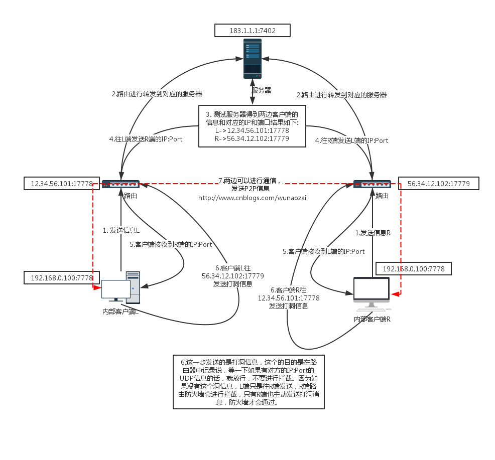
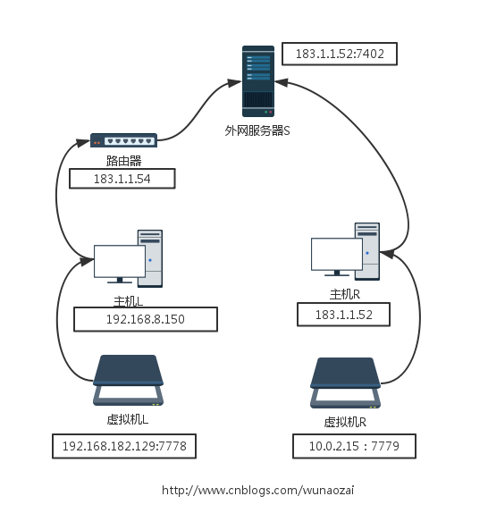
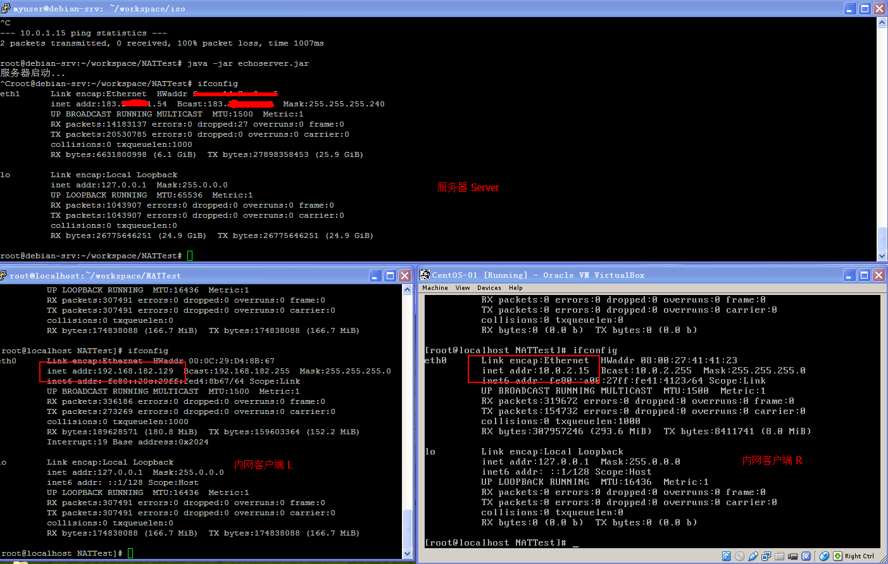
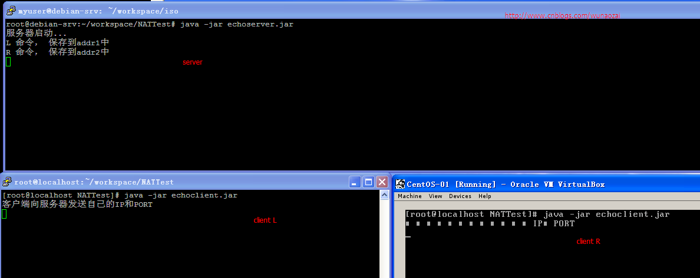
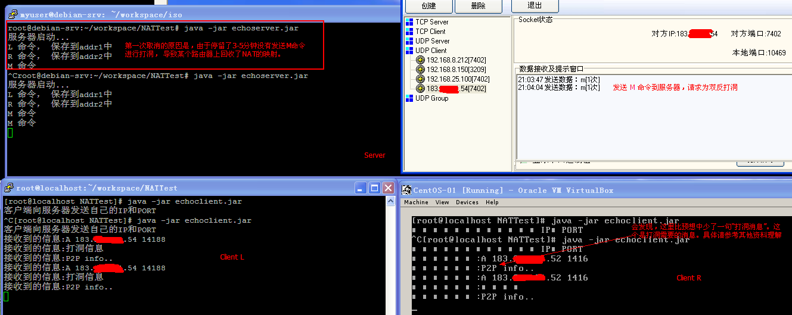
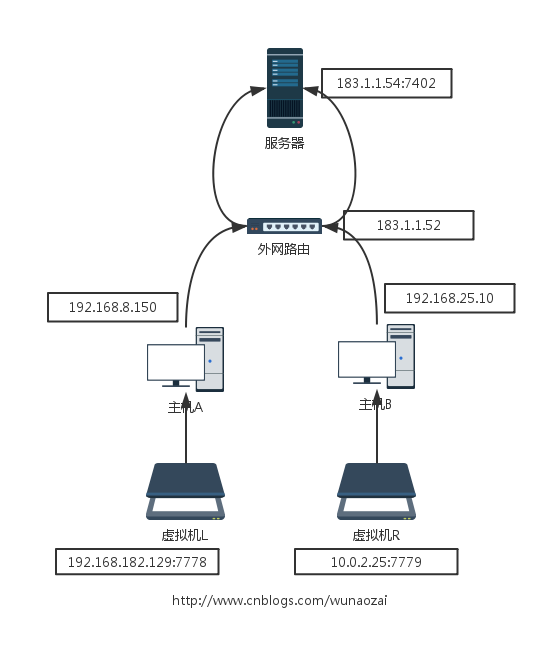
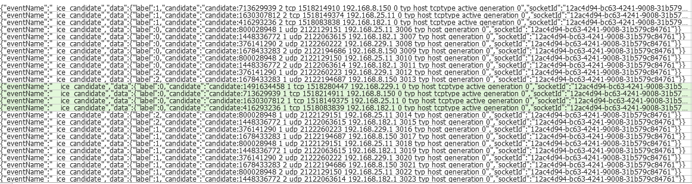

#P2P网络技术-UDP穿透实例
>本文将讲述WebRTC中使用的P2P技术，看一个UDP穿透的实例来理解STUN协议。
##一、 原理


##二、代码讲解
本次使用Java语言。网络框架使用Netty4。
服务器代码EchoServer.java

```Java 
package com.jieli.nat.echo;

import io.netty.bootstrap.Bootstrap;
import io.netty.channel.ChannelOption;
import io.netty.channel.EventLoopGroup;
import io.netty.channel.nio.NioEventLoopGroup;
import io.netty.channel.socket.nio.NioDatagramChannel;

public class EchoServer {
    
    public static void main(String[] args) {
        Bootstrap b = new Bootstrap();
        EventLoopGroup group = new NioEventLoopGroup();
        try {
            b.group(group)
             .channel(NioDatagramChannel.class)
             .option(ChannelOption.SO_BROADCAST, true)
             .handler(new EchoServerHandler());
            
            b.bind(7402).sync().channel().closeFuture().await();
        } catch (Exception e) {
            e.printStackTrace();
        } finally{
            group.shutdownGracefully();
        }
        
    }
}
```

服务器代码EchoServerHandler.java

```Java
package com.jieli.nat.echo;

import java.net.InetAddress;
import java.net.InetSocketAddress;

import io.netty.buffer.ByteBuf;
import io.netty.buffer.Unpooled;
import io.netty.channel.ChannelHandlerContext;
import io.netty.channel.SimpleChannelInboundHandler;
import io.netty.channel.socket.DatagramPacket;

public class EchoServerHandler extends SimpleChannelInboundHandler<DatagramPacket>{

    boolean flag = false;
    InetSocketAddress addr1 = null;
    InetSocketAddress addr2 = null;
    /**
     * channelRead0 是对每个发送过来的UDP包进行处理
     */
    @Override
    protected void channelRead0(ChannelHandlerContext ctx, DatagramPacket packet)
            throws Exception {
        ByteBuf buf = (ByteBuf) packet.copy().content();
        byte[] req = new byte[buf.readableBytes()];
        buf.readBytes(req);
        String str = new String(req, "UTF-8");
        if(str.equalsIgnoreCase("L")){
            //保存到addr1中 并发送addr2
            addr1 = packet.sender();
            System.out.println("L 命令， 保存到addr1中 ");
        }else if(str.equalsIgnoreCase("R")){
            //保存到addr2中 并发送addr1
            addr2 = packet.sender();
            System.out.println("R 命令， 保存到addr2中 ");
        }else if(str.equalsIgnoreCase("M")){
            //addr1 -> addr2
            String remot = "A " + addr2.getAddress().toString().replace("/", "")
                    +" "+addr2.getPort();
            ctx.writeAndFlush(new DatagramPacket(
                    Unpooled.copiedBuffer(remot.getBytes()), addr1));
            //addr2 -> addr1
            remot = "A " + addr1.getAddress().toString().replace("/", "")
                    +" "+addr1.getPort();
            ctx.writeAndFlush(new DatagramPacket(
                    Unpooled.copiedBuffer(remot.getBytes()), addr2));
            System.out.println("M 命令");
        }
        
    }

    @Override
    public void channelActive(ChannelHandlerContext ctx) throws Exception {
        System.out.println("服务器启动...");

        super.channelActive(ctx);
    }
}
```

左边客户端EchoClient.java

```Java
package com.jieli.nat.echo;

import io.netty.bootstrap.Bootstrap;
import io.netty.channel.ChannelOption;
import io.netty.channel.EventLoopGroup;
import io.netty.channel.nio.NioEventLoopGroup;
import io.netty.channel.socket.nio.NioDatagramChannel;

/**
 * 模拟P2P客户端
 * @author 
 *
 */
public class EchoClient{
    
    public static void main(String[] args) {
        int port = 7778;
        if(args.length != 0){
            port = Integer.parseInt(args[0]);
        }
        Bootstrap b = new Bootstrap();
        EventLoopGroup group = new NioEventLoopGroup();
        try {
            b.group(group)
             .channel(NioDatagramChannel.class)
             .option(ChannelOption.SO_BROADCAST, true)
             .handler(new EchoClientHandler());
            
            b.bind(port).sync().channel().closeFuture().await();
        } catch (Exception e) {
            e.printStackTrace();
        } finally{
            group.shutdownGracefully();
        }
    }
}
```

左边客户端EchoClientHandler.java

```Java
package com.jieli.nat.echo;

import java.net.InetSocketAddress;
import java.util.Vector;

import io.netty.buffer.ByteBuf;
import io.netty.buffer.Unpooled;
import io.netty.channel.ChannelHandlerContext;
import io.netty.channel.SimpleChannelInboundHandler;
import io.netty.channel.socket.DatagramPacket;

//L
public class EchoClientHandler extends SimpleChannelInboundHandler<DatagramPacket>{
    
    @Override
    protected void channelRead0(ChannelHandlerContext ctx, DatagramPacket packet)
            throws Exception {
        //服务器推送对方IP和PORT
        ByteBuf buf = (ByteBuf) packet.copy().content();
        byte[] req = new byte[buf.readableBytes()];
        buf.readBytes(req);
        String str = new String(req, "UTF-8");
        String[] list = str.split(" ");
        //如果是A 则发送
        if(list[0].equals("A")){
            String ip = list[1];
            String port = list[2];
            ctx.writeAndFlush(new DatagramPacket(
                    Unpooled.copiedBuffer("打洞信息".getBytes()), new InetSocketAddress(ip, Integer.parseInt(port))));
            Thread.sleep(1000);
            ctx.writeAndFlush(new DatagramPacket(
                    Unpooled.copiedBuffer("P2P info..".getBytes()), new InetSocketAddress(ip, Integer.parseInt(port))));
        }
        System.out.println("接收到的信息:" + str);
    }
    
    @Override
    public void channelActive(ChannelHandlerContext ctx) throws Exception {
        System.out.println("客户端向服务器发送自己的IP和PORT");
        ctx.writeAndFlush(new DatagramPacket(
                Unpooled.copiedBuffer("L".getBytes()), 
                new InetSocketAddress("183.1.1.1", 7402)));
        super.channelActive(ctx);
    }
}
```

右边客户端EchoClient2.java

```Java
package com.jieli.nat.echo;

import io.netty.bootstrap.Bootstrap;
import io.netty.channel.ChannelOption;
import io.netty.channel.EventLoopGroup;
import io.netty.channel.nio.NioEventLoopGroup;
import io.netty.channel.socket.nio.NioDatagramChannel;

/**
 * 模拟P2P客户端
 * @author 
 *
 */
public class EchoClient2{
    
    public static void main(String[] args) {
        Bootstrap b = new Bootstrap();
        EventLoopGroup group = new NioEventLoopGroup();
        try {
            b.group(group)
             .channel(NioDatagramChannel.class)
             .option(ChannelOption.SO_BROADCAST, true)
             .handler(new EchoClientHandler2());
            
            b.bind(7779).sync().channel().closeFuture().await();
        } catch (Exception e) {
            e.printStackTrace();
        } finally{
            group.shutdownGracefully();
        }
    }
}
```

右边客户端EchoClientHandler2.java

```Java
package com.jieli.nat.echo;

import java.net.InetSocketAddress;
import java.util.Vector;

import io.netty.buffer.ByteBuf;
import io.netty.buffer.Unpooled;
import io.netty.channel.ChannelHandlerContext;
import io.netty.channel.SimpleChannelInboundHandler;
import io.netty.channel.socket.DatagramPacket;

public class EchoClientHandler2 extends SimpleChannelInboundHandler<DatagramPacket>{

    @Override
    protected void channelRead0(ChannelHandlerContext ctx, DatagramPacket packet)
            throws Exception {
        //服务器推送对方IP和PORT
        ByteBuf buf = (ByteBuf) packet.copy().content();
        byte[] req = new byte[buf.readableBytes()];
        buf.readBytes(req);
        String str = new String(req, "UTF-8");
        String[] list = str.split(" ");
        //如果是A 则发送
        if(list[0].equals("A")){
            String ip = list[1];
            String port = list[2];
            ctx.writeAndFlush(new DatagramPacket(
                    Unpooled.copiedBuffer("打洞信息".getBytes()), new InetSocketAddress(ip, Integer.parseInt(port))));
            Thread.sleep(1000);
            ctx.writeAndFlush(new DatagramPacket(
                    Unpooled.copiedBuffer("P2P info..".getBytes()), new InetSocketAddress(ip, Integer.parseInt(port))));
        }
        System.out.println("接收到的信息:" + str);
    }
    
    @Override
    public void channelActive(ChannelHandlerContext ctx) throws Exception {
        System.out.println("客户端向服务器发送自己的IP和PORT");
        ctx.writeAndFlush(new DatagramPacket(
                Unpooled.copiedBuffer("R".getBytes()), 
                new InetSocketAddress("1831.1.1", 7402)));
        super.channelActive(ctx);
    }
}
```
##三、 实验环境模拟
实验环境：1台本地主机L，里面安装虚拟机L，地址192.168.182.129. 通过路由器183.1.1.54上网。 1台服务器主机S，服务器地址183.1.1.52:7402, 同时服务器里安装虚拟机R，地址10.0.2.15 .由于外网地址只有两个，所以这能这样测试。通过虚拟机也是可以模拟出测试环境的。  图示如下:

三台测试机ip如下

三台测试机器分别启动

然后通过第三方工具发送一个M指定到服务器


一般路由器的缓存会保存一小段时间，具体跟路由器有关。

关于Client R会少接收到一个"打洞消息"这个信息。不是因为UDP的丢包，是Client L 发送的打洞命令。简单说一下。一开始ClientL发送一个UDP到Server，此时ClientL的路由器会保留这样的一条记录(ClientL:IP:Port->Server:IP:Port) 所以Server:IP:Port发送过来的信息，ClientL路由器没有进行拦截，所以可以接收得到。但是ClientR:IP:Port发送过来的消息在ClientL的路由器上是没有这一条记录的，所以会被拒绝。此时ClientL主动发送一条打洞消息(ClientL:IP:Port->ClientR:IP:Port), 使ClientL路由器保存一条记录。使ClientR可以通过指定的IP:Port发送信息过来。不过ClientL的这条打洞信息就不一定能准确的发送到ClientR。原因就是，同理，ClientR路由器上没有ClientL的记录。

由于ClientL ClientR路由器上都没有双方的IP:port，所以通过这样的打洞过程。

还有一个就是搭建这样的测试环境还是比较麻烦的。注意如果你只有一台电脑，然后搭建成下面这种测试环境，一般是不行的。因为ClientL和ClientR是通过183.1.1.52路由器进行数据的P2P传输，一般路由器会拒绝掉这种回路的UDP包。

这个时候就要进行内网的穿透了。这个就要像我上一篇博客里面的Webrtc是如何通信一样的了，要通过信令来交换双方信息。

就是发送包括自己内网的所有IP，支持TCPUDP等其他信息封装成信令发送到服务器然后转发到另一端的客户端。使客户端可以对多个IP:Port进行尝试性连接。这个具体的就不展开了。