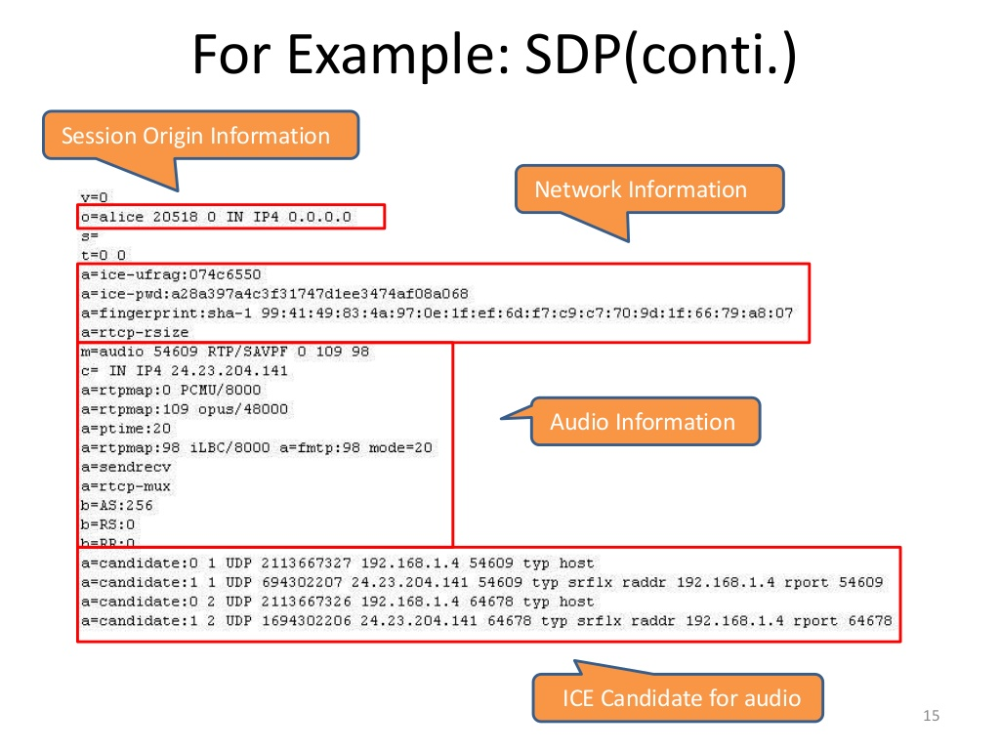
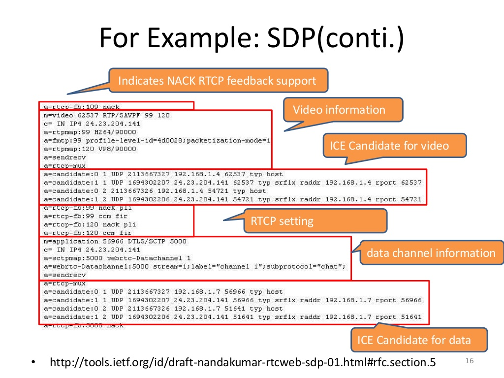
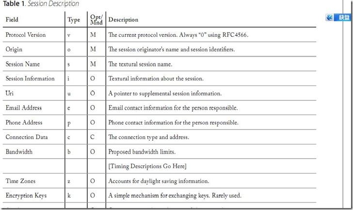
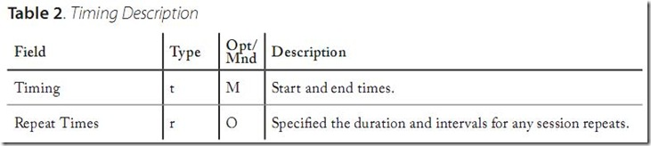
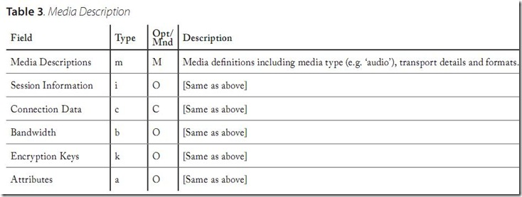
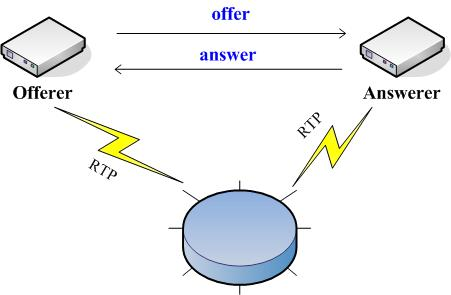

# SDP协议详解
>本文将介绍WebRTC中的SDP协议，实际上SDP协议并不属于WebRTC专有协议。

## 一、SDP简述
ICE信息的描述格式通常采用标准的SDP,其全称为Session Description Protocol,即会话描述协议。SDP只是一种信息格式的描述标准,不属于传输协议,但是可以被其他传输协议用来交换必要的信息,如会话通知协议（SAP）、会话初始协议（SIP）、实时流协议（RTSP）、MIME 扩展协议的电子邮件以及超文本传输协议（HTTP）等。SDP协议是基于文本的协议，协议的可扩展性比较强，其具有广泛的应用范围。SDP 不支持会话内容或媒体编码的协商，所以在流媒体中只用来描述媒体信息。媒体协商这一块要用RTSP来实现。

流媒体协议sdp信息，附带在describe报文中有rtsp服务端发出，主要目的，告之会话的存在和给出参与该会话所必须的信息，sdp会话完全是文本形式，采用UTF-8编码的ISO 10646字符集。

**图1-SDP协议例子**

**图2-SDP协议例子续**


**sdp描叙符包括：**

+ 会话名和目的
+ 会话激活的时间区段
+ 构成会话的媒体
+ 接收这些媒体所需要的信息（地址，端口，格式）
+ 会话所用的带宽信息
+ 会话拥有者的联系信息

**媒体信息包括：**

+ 媒体类型（视频，音频等）
+ 传送协议（RTP/UDP/IP H.320等）
+ 媒体格式（H,264视频，MPEG视频等）
+ 媒体地址和端口

一般来说,SDP必须包含充分的信息使得应用程序能够加入会话,并且可以提供任何非参与者使用时需要知道的资源 状况,后者在当SDP同时用于多个会话声明协议时尤其有用。

##二、SDP协议格式
SDP描述由许多文本行组成，文本行的格式为<类型>=<值>，<类型>是一个字母，<值>是结构化的文本串，其格式依<类型>而定。

常见的fields有:








##三、Offer/Answer模型
SDP（会话描述协议），在WebRTC主要用于两个会话实体之间的媒体协商，并达成一致，属信令语言族，采用文本（字符）描述形式。rfc3264协议主要概述一个请求/响应模型（offer/answer，以下叙述采用英文），包括请求/响应的实体和不同阶段的操作行为，如初始协商过程和重协商过程，并简单介绍消息中各种参数的含义。具体各个参数的详细说明见rfc2327协议。



###3.1实体、消息

Offer/Answer模型包括两个实体，一个是请求主体Offerer，另一个是响应实体Answerer，两个实体只是在逻辑上进行区分，在一定条件可以转换。例如，手机A发起媒体协商请求，那么A就是Offerer，反之如果A为接收请求则为Offerer。

Offerer发给Answerer的请求消息称为请求offer，内容包括媒体流类型、各个媒体流使用的编码集，以及将要用于接收媒体流的IP和端口。

Answerer收到offer之后，回复给Offerer的消息称为响应，内容包括要使用的媒体编码，是否接收该媒体流以及告诉Offerer其用于接收媒体流的IP和端口。
###3.2 SDP各个参数简单介绍

下面示例摘自3264协议:

```
v=0                                                                              

o=carol 28908764872 28908764872 IN IP4 100.3.6.6        //会话ID号和版本

s=-                                     //用于传递会话主题

t=0 0                                   //会话时间，一般由其它信令消息控制，因此填0

c=IN IP4 192.0.2.4              //描述本端将用于传输媒体流的IP

m=audio 0 RTP/AVP 0 1 3     //媒体类型 端口号 本端媒体使用的编码标识（Payload）集

a=rtpmap:0 PCMU/8000 //rtpmap映射表，各种编码详细描述参数，包括使用带宽（bandwidth）

a=rtpmap:1 1016/8000

a=rtpmap:3 GSM/8000

a=sendonly     //说明本端媒体流的方向，取值包括sendonly/recvonly/sendrecv/inactive

a=ptime:20                           //说明媒体流打包时长

m=video 0 RTP/AVP 31 34

a=rtpmap:31 H261/90000

a=rtpmap:34 H263/90000
```

###3.3 实体行为、操作过程
####3.3.1 初始协商的Offer请求

实体A <-> 实体B，实体首先发起Offer请求，内容如3.2节所示，对于作何一个媒体流/媒体通道，这时实体A必须：

1. 如果媒体流方向标为recvonly/sendrecv，即a=recvonly或a=sendrecv，则A必须（MUST）准备好在这个IP和端口上接收实体B发来的媒体流；

2. 如果媒体流方向标为sendonly/inactive，即a=recvonly或a=sendrecv，则A不需要进行准备。

####3.3.2 Answer响应

实体B收到A的请求offer后，根据自身支持的媒体类型和编码策略，回复响应。

1. 如果实体B回复的响应中的媒体流数量和顺序必须（MUST）和请求offer一致，以便实体A进行甄别和决策。即m行的数量和顺序必须一致，B不能（MUST NOT）擅自增加或删除媒体流。如果B不支持某个媒体流，可以在对应的端口置0，但不能不带这个m行描述。

2. 对于某种媒体，实体B必须（MUST）从请求offer中选出A支持且自己也支持的该媒体的编码标识集，并且可以（MAY）附带自己支持的其它类型编码。

3. 对于响应消息中各个媒体的方向：
>* 如果请求某媒体流的方向为sendonly，那么响应中对应媒体的方向必须为recvonly；
>* 如果请求某媒体流的方向为recvonly，那么响应中对应媒体的方向必须为sendonly；
>* 如果请求某媒体流的方向为sendrecv，那么响应中对应媒体的方向可以为sendrecv/sendonly/recvonly/inactive中的一种；
>* 如果请求某媒体流的方向为inactive，那么响应中对应媒体的方向必须为inactive；

4. 响应answer里提供IP和端口，指示Offerer本端期望用于接收媒体流的IP和端口，一旦响应发出之后，Offerer必须（MUST）准备好在这个IP和端口上接收实体A发来的媒体流。

5. 如果请求offer中带了ptime（媒体流打包间隔）的a行或带宽的a行，则响应answer也应该（SHOULD）相应的携带。

6. 实体B Offerer应该（SHOULD）使用实体A比较期望的编码生成媒体流发送。一般来说对于m行，如m=video 0 RTP/AVP 31 34，排充越靠前的编码表示该实体越希望以这个编码作为载体，这里示例31(H261)，34（H263）中H261为A更期望使用的编码类型。同理，当实体A收到响应answer后也是这样理解的。

####3.3.3 实体收到响应后的处理

当实体A收到B回复的响应后，可以（MAY）开始发送媒体流，如果媒体流方向为sendonly/sendrecv，

1. 必须（MUST）使用answer列举的媒体类型/编码生成媒体发送；

2. 应该（SHOULD）使用answer中的ptime和bandwidth来打包发送媒体流；

3. 可以（MAY）立即停止监听端口，该端口为offer支持answer不支持的媒体所使用的端口。


###3.4 修改媒体流（会话）
修改媒体流的offer-answer操作必须基于之前协商的媒体形式（音频、视频等），不能（MUST NOT）对已有媒体流进行删减。

####3.4.1 删除媒体流

如果实体认定新的会话不支持之前媒商的某个媒体，新的offer只须对这种媒体所在m行的端口置0，但不能不描述这种媒体，即不带对应m行。当answerer收到响应之后，处理同初始协商一样。

####3.4.2 增加媒体流

如果实体打算新增媒体流，在offer里只须加上描述即可或者占用之前端口被置0的媒体流，即用新的媒体描述m行替换旧的。当answerer收到offer请求后，发现有新增媒体描述，或者过于端口被置0的媒体行被新的媒体描述替换，即知道当前为新增媒体流，处理同初始协商。

####3.4.3 修改媒体流

修改媒体注主要是针对初始协商结果，如果有变更即进入修改流程处理，可能的变更包括IP地址、端口，媒体格式（编码），媒体类型（音、视频），媒体属性（ptime，bandwidth，媒体流方向变更等）。
